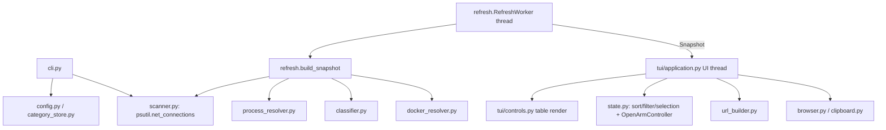

# LocalhostMaster — Developer Handover

> Handover document for the next developer or AI coding agent.
> Written after Phase 2 implementation. Read this before making changes.
>
> Confidence tags used throughout: **[VERIFIED]** (confirmed by code/tests/actual
> execution), **[INFERRED]** (reasonable inference from code structure),
> **[UNKNOWN]** (cannot confirm).

---

## 1. Project Overview

- **Name:** LocalhostMaster
- **Purpose:** A lightweight Windows TUI to inspect local listening ports and
  the processes behind them, open a selected endpoint in the default browser,
  and categorise endpoints by service type.
- **Core features:** TCP LISTEN + UDP bound enumeration (IPv4/IPv6); process
  metadata; built-in + user category rules with colours; double-Enter to open
  in browser; background refresh; optional Docker enrichment; plain-text/JSON
  non-interactive output.
- **Tech stack:** Python 3.11+ (developed on 3.14.6), `psutil` (native Windows
  IP Helper), `prompt_toolkit` (full-screen TUI). Standard library `tomllib`,
  `ctypes`, `unittest`. No third-party TUI framework, no Rust/Go/.NET.
- **Current phase:** Phase 2 complete — a runnable, tested product exists.
  Phase 3 is open-ended (see §11). **Nothing has been committed to git.**
- **Overall goal:** Stay small and fast (startup, memory, CPU) while giving a
  clear, accessible view of "what is listening on this machine".

**Status honesty note:** This is a working local tool, **not** a released
product. It has never run in CI and has only been exercised on one machine.
As of Phase 3 the package **has** been installed into a throwaway virtual
environment (see §7) and the console entry point is verified; only Python 3.14
has been exercised (not 3.11).

---

## 2. Current Status

### Phase 3 — Correctness hardening & deliverability (current) — [VERIFIED]

- **Connected-TCP identity** (`models.py`, `scanner.py`, `url_builder.py`,
  `state.py`, `cli.py`, `tui/controls.py`): non-LISTEN TCP rows now carry
  `remote_address`/`remote_port`, which participate in `EndpointKey`. Two
  connections sharing a local endpoint but different peers no longer collide.
  Only TCP **LISTEN** is openable. Remote endpoints are shown in text/JSON and
  in a wide-screen TUI column when established rows are displayed.
- **Bounded PID verification** (`process_resolver.py`): reuses metadata only
  while `create_time` is unchanged; re-verifies every 45 s (one cheap
  `create_time` read), on endpoint-set change, on reappearance, and after a
  `GONE`/`UNKNOWN` state. `AccessDenied` degrades. Steady build stays ~2.6 ms.
- **Local install verified**: `pip install . --no-deps --no-build-isolation`
  + console script + `python -m localhostmaster` in a throwaway venv (§7).
- **Docker once mode** (`cli.py`): `--once`/`--json` do one bounded synchronous
  `refresh_once()` before scanning; the TUI path stays fully async.
- **Input validation** (`config.py`, `category_store.py`, `cli.py`,
  `tui/application.py`): `refresh_ms` floor, port bounds `1..65535`, scheme
  restricted to `http`/`https`, control characters rejected in category names.
- **Public classifier API**: `user_rules`/`builtin_rules` read-only properties
  and `replace_user_rules()`; no more `classifier._user_rules` access.
- **Startup scan deduplication** (`refresh.py`): the worker waits one interval
  before its first scan, so the synchronous pre-run scan is not repeated.
- **Tests:** 185 passing (111 inherited + 74 new). A later adversarial bug
  audit added 7 regression tests; see `report/know_bugs.md`.

### Completed (Phase 2) — [VERIFIED]

- **Scanning** (`scanner.py`): `psutil.net_connections(kind="inet")`; TCP
  LISTEN + UDP bound by default; other TCP states only with `show_established`;
  IPv4/IPv6; scope-aware IPv6 handling.
- **Process resolution** (`process_resolver.py`): name, exe, username,
  (internal, never-logged) command line; access states `OK/DENIED/GONE/UNKNOWN/
  NO_PID`; previous-scan-aware cache.
- **Classification** (`classifier.py`): 5 built-in categories + `unknown`
  fallback; user rules; priority ordering; AND-across-fields / OR-within-field;
  `exclude_*` veto; globs (case-insensitive on Windows) + optional `re:` regex
  with error tolerance; command-line rules never match when cmdline unreadable.
- **Config & categories** (`config.py`, `category_store.py`): TOML read;
  minimal hand-written TOML writer; atomic writes (temp + `fsync` +
  `os.replace`); corrupt files never auto-overwritten; warnings surfaced.
- **TUI** (`tui/application.py`, `tui/controls.py`, `tui/styles.py`): table,
  cursor, paging, responsive columns, search, filter, sort, pause, help,
  category manager (new/edit/delete, confirm delete, built-in read-only,
  prefill from selected row), notifications, colour modes + ASCII fallback.
- **Double-Enter + open** (`state.py`, `url_builder.py`, `browser.py`,
  `clipboard.py`): deterministic state machine; `os.startfile`; Win32 Unicode
  clipboard via `ctypes`.
- **Docker enrichment** (`docker_resolver.py`): background thread, TTL 15 s,
  timeout 2 s, `CREATE_NO_WINDOW`, silent degradation.
- **CLI** (`cli.py`): `--version --once --json --show-established --no-docker
  --config --refresh-ms --no-color --debug`; non-TTY auto-fallback to text;
  rotating debug log.
- **Tests:** 185 tests, all passing as of Phase 3 (see §8).
- **Docs:** `README.md` (user-facing), this file (developer handover).

### In Progress

- Nothing is mid-edit. The working tree is a complete, consistent snapshot.

### Not Started

- `tui/keybindings.py` and `tui/category_dialog.py` (merged into
  `tui/application.py` — see §10).
- Standalone EXE packaging (deliberately not done; no bundler installed).
- CI, linting config, type checking, cross-platform backends.
- Git history (repo initialised, zero commits).

### Known Issues

- Non-admin users cannot read other users'/protected processes' command lines
  → command-line rules silently don't match those processes. **[VERIFIED]**
- `docker_resolver` marks itself disabled if `docker` is not on `PATH`, even if
  `docker_enabled = true` in config. **[VERIFIED]** (constructor logic)
- Docker port→container mapping is an inference from `docker ps`, not from the
  OS socket table. **[VERIFIED]**
- Any TCP **listener** port can be opened as `http(s)://…`; no protocol
  probing, so non-HTTP services will show an error page. Connected TCP rows and
  UDP are not openable. **[VERIFIED]**
- Startup to first screen is ~0.7–0.8 s (Python interpreter cost), not
  instant. **[VERIFIED]**
- ~~`_load_classifier(config_path, categories_path)` ignores its first
  argument.~~ **Fixed in Phase 3** — signature is now `_load_classifier(categories_path)`.
- ~~Private attribute access `classifier._user_rules`.~~ **Fixed in Phase 3** —
  public `user_rules`/`builtin_rules` properties + `replace_user_rules()`.
- ~~`pyproject.toml` build/install has not been tested.~~ **Fixed in Phase 3** —
  installed offline in a throwaway venv; console script and `python -m` both
  verified (§7).

### Blocked

- None hard-blocked. Docker enrichment is conditionally available (Docker was
  running during development, WSL2 backend). EXE packaging is gated on the
  user granting permission to install a bundler. **[VERIFIED]**

---

## 3. Recent Changes

There are **no git commits** — `git log` fails with "your current branch 'main'
does not have any commits yet". Therefore all current content is **current
session work**; there is **no pre-existing work** and no mixed-origin changes.

Summary of what the current session produced (whole tree):

- Initialised the git repo (`git init`, branch `main`) but made **no commits**.
- Created `pyproject.toml`, `.gitignore`, `README.md`.
- Created the full `src/localhostmaster/` package (19 `.py` files) implementing
  the pipeline, TUI, config, classification, Docker, clipboard, CLI.
- Created `tests/` (12 files, 111 tests).
- Fixed during development:
  - Built-in `docker` category originally used `match_any_container` ANDed with
    process globs, so it never matched. Split into two rules
    (`builtin.docker`, `builtin.docker.container`). **[VERIFIED]**
  - Process resolution was ~167 ms per scan because every PID was fully
    re-queried each refresh. Added a previous-scan fast path →
    steady-state ~9 ms. **[VERIFIED]**
  - `DockerResolver.refresh_once()` now no-ops when disabled. **[VERIFIED]**
  - `Application` does not accept a `pre_run` constructor argument in this
    prompt_toolkit version; the app registers its pre-run via
    `app.pre_run_callables.append(...)` instead. **[VERIFIED]**
- Two test expectations were corrected to match intended behaviour (internal
  Docker ports are not emitted; disabled resolver ignores manual refresh).

All changes were verified by running the full test suite (111 passing) and by
running the CLI on the host machine.

**Phase 3 (correctness hardening & deliverability):** remote-endpoint identity
for connected TCP + LISTEN-only openability; bounded PID verification;
offline local-install/console-entry verification; Docker once-mode confirmed
and covered; config/input validation (refresh_ms floor, port bounds,
http/https scheme, control-char names); public classifier API; and removal of
the duplicate startup scan. Test count grew from 111 to 178. A subsequent
adversarial bug audit (`report/know_bugs.md`) was then fixed: help-page key
handler, TUI edit dropping advanced rule fields, DENIED cache never expiring,
`--config` empty-name crash, atomic-write temp leakage, and worker/resolver
restart. Total is now **185 tests**. Still **no git commits** (user has not
authorised one).

---

## 4. Architecture

Data flows one way: OS socket table → enrichment → classification → snapshot →
worker thread → UI state → render.



- **No database, no external API, no web server, no backend service.**
- **Threads:** one `RefreshWorker` daemon thread for scanning; one
  `docker-resolver` daemon thread (only when Docker is enabled and available).
  The UI thread never runs `psutil` scans directly (except the single initial
  synchronous scan in pre-run for first paint).
- **Cross-thread handoff:** worker calls `on_snapshot` on its own thread; the
  app marshals to the loop via `app.loop.call_soon_threadsafe` (`_schedule`).
  The worker never touches prompt_toolkit widgets directly.
- **Generations:** each scan increments a generation; the UI drops snapshots
  older than the last applied one.
- **UI modes:** a `DynamicContainer` swaps between `main`, `help`, `search`,
  `filter`, `categories`, `category_form` roots. Text input uses
  `prompt_toolkit.widgets.TextArea` with per-control key bindings (needed
  because the focused control's bindings take priority over app bindings).
- **Non-interactive path:** when stdout or stdin is not a TTY, the CLI skips
  the TUI entirely and prints one scan.

---

## 5. Important Files

| File | Purpose | Importance |
| --- | --- | --- |
| `src/localhostmaster/tui/application.py` | The entire TUI: modes, key bindings, category dialog, renderers (~940 lines). Highest-risk file. | High |
| `src/localhostmaster/refresh.py` | `build_snapshot()` pipeline + `RefreshWorker` thread. | High |
| `src/localhostmaster/classifier.py` | Built-in rules + matching semantics + `re:` support. | High |
| `src/localhostmaster/category_store.py` | TOML serializer, atomic write, tolerant parsing. | High |
| `src/localhostmaster/process_resolver.py` | Process metadata + performance cache; privacy-sensitive. | High |
| `src/localhostmaster/models.py` | All dataclasses/enums; `EndpointKey`, `ArmedOpenState`. | High |
| `src/localhostmaster/cli.py` | Arg parsing, non-TTY fallback, debug logging. | High |
| `src/localhostmaster/scanner.py` | psutil scan + address normalization. | Medium |
| `src/localhostmaster/state.py` | Double-Enter state machine; sort/filter/selection retention. | Medium |
| `src/localhostmaster/docker_resolver.py` | Optional Docker enrichment; timeout/parse logic. | Medium |
| `src/localhostmaster/url_builder.py` | Pure URL construction (easy to unit test). | Medium |
| `src/localhostmaster/config.py` | `config.toml` load/validate. | Medium |
| `tests/test_tui_smoke.py` | Headless end-to-end TUI test (renders all modes, drives open flow). | High |
| `tests/test_open_state.py` | Deterministic double-Enter tests — the canonical spec. | High |
| `README.md` | User-facing docs; also states intended behaviour. | Medium |
| `pyproject.toml` | Deps, entry point, Python floor. | Medium |

---

## 6. Environment & Setup

- **OS:** Windows 11 Home, build 26200, AMD64. **[VERIFIED]**
- **Shell used:** Windows PowerShell 5.1 (commands below are PowerShell). **[VERIFIED]**
- **Terminal:** Windows Terminal. Console output code page is OEM (e.g. 437),
  so a real TUI must rely on prompt_toolkit's VT output; do **not** call
  `chcp` (a hard product rule). **[VERIFIED]**
- **Python:** 3.14.6 at
  `C:\Users\fiank\AppData\Local\Python\pythoncore-3.14-64\python.exe`.
  `requires-python = ">=3.11"` (because `tomllib`).
- **Installed deps (verified versions):**
  - `psutil 7.2.2`
  - `prompt_toolkit 3.0.52`
- **Package manager:** `uv` and `pip` are present. The package is normally run
  from source via `PYTHONPATH=src`. A local install **has** been verified in a
  throwaway venv during Phase 3 (§7); `setuptools` is **not** installed in the
  base interpreter, so `--no-build-isolation` needs a local setuptools (the
  cached `setuptools==81.0.0` satisfied this offline). **[VERIFIED]**
- **Not installed:** `ruff`, `pytest` (use `unittest`), Rust, Go, .NET SDK.
  **[VERIFIED]**
- **Docker:** Docker Desktop 29.7.2 running (WSL2 backend) during development.
  **[VERIFIED]**
- **Environment variables:** none required by the app. Optional behaviour uses
  `NO_COLOR` (standard) and `APPDATA` / `LOCALAPPDATA` for config/log paths.
  **No secrets, credentials, or tokens are used by this project.** **[VERIFIED]**

---

## 7. How to Run

All commands must be run from the repository root
(`D:\Projects\LocalhostMaster`).

### Install / setup

```powershell
$env:PYTHONPATH = "src"   # required every new shell when running from source
```

Local install (verified in Phase 3, in a throwaway venv, offline):

```powershell
python -m venv --system-site-packages <venv>
# offline build backend: install cached setuptools first if not present
uv pip install setuptools==81.0.0 --python <venv>\Scripts\python.exe --no-deps --offline
<venv>\Scripts\python.exe -m pip install . --no-deps --no-build-isolation
<venv>\Scripts\localhostmaster.exe --version       # localhostmaster 0.1.0
<venv>\Scripts\python.exe -m localhostmaster --version
```

### Development

```powershell
$env:PYTHONPATH = "src"
python -m localhostmaster                 # full-screen TUI (needs a real TTY)
python -m localhostmaster --once          # one scan, plain text
python -m localhostmaster --json          # one scan, JSON
python -m localhostmaster --no-docker --no-color
python -m localhostmaster --debug --once  # writes rotating log (see below)
```

### Test

```powershell
$env:PYTHONPATH = "src"
python -m unittest discover -s tests -v
python -m compileall src tests
```

### Build

None. There is no build step and no packaging config beyond `pyproject.toml`.

### Production

Not applicable. This is a local developer tool; no deployment target exists.

### Logs (only with `--debug`)

`%LOCALAPPDATA%\LocalhostMaster\logs\localhostmaster.log` (rotating, 512 KiB ×
3). Logs must never contain command lines, Docker JSON, or env vars. **[VERIFIED]**

---

## 8. Testing Status

- **Framework:** standard library `unittest` (no pytest).
- **Command:** `python -m unittest discover -s tests -v`
- **Last result (Phase 3 + bug-audit fixes):** `Ran 185 tests` — **OK**
  (0 failures, 0 errors, 0 skipped). **[VERIFIED]**
- **`python -m compileall src tests`:** OK. **[VERIFIED]**

Added in Phase 3:

| File | Covers |
| --- | --- |
| `test_tcp_identity.py` | remote-endpoint identity, no collision, LISTEN-only openability, connected Enter does not open, remote in JSON/text/TUI, live ESTABLISHED `raddr` capture |
| `test_process_resolver_cache.py` | create_time TTL verification, fingerprint change, reappearance, AccessDenied/NoSuchProcess, cmdline never logged |
| `test_browser_clipboard.py` | `os.startfile` mock (once, OSError→BrowserError), clipboard alloc/lock/set failure cleanup and ownership transfer |
| `test_worker_lifecycle.py` | worker wait-first, stop/join idempotency, no post-stop snapshots, error survival, startup no duplicate scan |
| `test_docker_lifecycle.py` | once-mode refresh without thread, start/stop/join, mapping replace isolation, concurrent lookup |
| `test_form_validation.py` | port bounds, control-char names, scheme rejection in the TUI form |

Test files and focus:

| File | Covers |
| --- | --- |
| `test_scanner_normalization.py` | address/family/scope normalization + live loopback bind integration (TCP v4, TCP v6, UDP) |
| `test_url_builder.py` | IPv4/IPv6/wildcard URLs, brackets, scheme, UDP not openable |
| `test_open_state.py` | double-Enter state machine (all timing branches) + selection retention |
| `test_classifier.py` | builtin hits, user-over-builtin, priority, OR/AND, exclude, cmdline-unavailable, regex |
| `test_config.py` | corrupt/missing/valid config, unknown keys, invalid color mode |
| `test_category_store.py` | TOML escaping/roundtrip, atomic write preserves original on failure |
| `test_refresh_merge.py` | snapshot build with fakes, PID-gone race, first_seen, sort/filter/search, JSON privacy |
| `test_docker_parser.py` | port/label parsing, timeout/error degradation |
| `test_process_resolver.py` | current-pid resolve, dead pid → GONE, fast-path reuse, pruning |
| `test_tui.py` | column selection, table text, colour/no-colour styles, ASCII fallback |
| `test_cli_modes.py` | `--version`, non-TTY text (no ANSI), JSON |
| `test_tui_smoke.py` | headless (DummyInput/pipe + DummyOutput) render of every mode + open flow + category save |

**No failures are being hidden.** Notes on test reliability:

- `test_tui_smoke.py` uses a real event loop with `call_later`. Timers can be
  **batched** if the loop is busy, so `test_double_enter_opens_once`
  deliberately sets `app.arm.armed.accept_after = 0.0` before the second press
  rather than relying on wall-clock separation. Do not "simplify" this.
- Integration tests bind only `127.0.0.1` / `::1` on random ports and close
  immediately; they do not bind `0.0.0.0` or use fixed ports.
- Tests never open a real browser (they use `RecordingOpener` /
  `RecordingClipboard` / fake Docker runners).
- **Coverage gaps [INFERRED]:** no test exercises the real `os.startfile`
  path, the real ctypes clipboard, terminal resize mid-run, or `pip install`.
- No flaky tests observed across repeated runs in this session. **[INFERRED
  from limited runs]**

---

## 9. Known Problems & Pitfalls

Ordered roughly by how likely they are to bite the next agent.

1. **`prompt_toolkit` key-binding precedence (subtle).** The focused control's
   key bindings win over `Application.key_bindings`. This is why table
   navigation bindings are gated with `Condition(mode == MAIN)` and why search
   /form `TextArea`s attach their own bindings via
   `area.control.key_bindings = kb`. If you add a global binding that must work
   while a TextArea is focused, it will be swallowed unless you attach it to
   the control.
2. **`Application` has no `pre_run=` constructor argument** in prompt_toolkit
   3.0.52. Use `app.pre_run_callables.append(callable)`. Also note the order:
   a `pre_run` passed to `app.run(pre_run=...)` executes **before**
   `pre_run_callables`, so the app's first scan happens *after* your run-level
   pre_run.
3. **Do not run the TUI under the agent's shell expecting output.** The tool
   harness is non-TTY, so `python -m localhostmaster` prints a one-shot table.
   To test UI behaviour, use `tests/test_tui_smoke.py` (headless) or a real
   Windows Terminal.
4. **Process resolver cache is deliberately bounded (Phase 3).** `resolve()`
   reuses metadata only when the PID was in the previous scan, its endpoint
   fingerprint is unchanged, it is not `GONE`/`UNKNOWN`, and its `create_time`
   was verified within the last 45 s. Re-verification reads *only*
   `create_time` (one syscall); a changed value triggers a full re-resolve.
   Do not regress this into a full re-resolve every scan (~200 ms) or remove
   the TTL entirely. Measured: steady build ~2.6 ms, re-verification round
   ~11 ms.
5. **Do not log or serialise `ProcessInfo.command_line`.** It is intentionally
   collected for classification only. JSON output and logging must omit it
   (`cli._json_record` already does). There is a test guarding this.
6. **`DockerResolver.enabled` is `False` when `docker` is not on PATH**, even
   if config says enabled. And `refresh_once()` no-ops when disabled (tests
   rely on this).
7. **Docker output is not raw-logged.** Only counts/errors are logged. Keep it
   that way — labels can contain sensitive data.
8. **`--config PATH` also relocates `categories.toml`** to the same directory
   (`Path(config).with_name("categories.toml")`). This is intentional so
   `--config` is useful for isolated test/config dirs.
9. **Config file paths:** `%APPDATA%\LocalhostMaster\config.toml` and
   `categories.toml`. Files are only created when the user first saves; startup
   never creates them.
10. **Atomic writes are load-bearing.** `category_store.atomic_write_text`
    writes a temp file in the same directory, `flush`+`fsync`, then
    `os.replace`. A corrupt existing file must never be auto-overwritten. Do
    not replace this with a naive `write_text`.
11. **TOML writing is hand-rolled** because `tomllib` is read-only and no
    third-party dep is allowed. `toml_string` handles quotes/backslash/control
    chars/Unicode. If you add fields to `CategoryRule`, update both
    `dumps_categories` and `parse_category`, and add a roundtrip test.
12. **Category matching semantics:** user rules always outrank built-in rules;
    within a source it is priority-desc then file order; first match wins.
    A rule with no positive condition is skipped (prevents a catch-all rule
    from swallowing everything).
13. **`match_any_container` is a positive condition**, not an OR-with-process
    shortcut. The docker category therefore uses **two** built-in rules. If you
    naively add it back to one rule, docker-by-process stops matching (this was
    an actual bug).
14. **Only TCP is openable.** UDP rows show `-` and never arm. Don't make UDP
    openable.
15. **No `chcp`.** Never change the user's console code page. Rely on
    prompt_toolkit VT output and the colour-depth setting.
16. **Colour is never the sole signal.** Category text is always rendered;
    `ascii_only` swaps Unicode icons for ASCII. Keep this when editing
    `tui/controls.py` / `tui/styles.py`.
17. **`tui/application.py` is large (~940 lines).** Any change there is
    high-blast-radius. Prefer extracting a module over growing it further.
18. **`report/` is not ignored.** `HANDOVER.md` was added after `.gitignore`
    was written, so `report/` will show as untracked. Decide whether to commit
    it.
19. **No commits exist.** Everything is untracked. `git status` will show
    entire directories; do not assume prior work.

---

## 10. Decisions & Rationale

### Decision: Python + psutil + prompt_toolkit (not Rust/Go/Node)

- **Reason:** psutil calls the native Windows IP Helper API directly (~2 ms
  for all sockets) with zero toolchain installation; prompt_toolkit was already
  present; TOML is in the stdlib. This was the best match for the confirmed
  environment (no Rust/Go/C compiler).
- **Alternatives:** Rust + ratatui (fastest/smallest, but toolchain not
  installed), Go + Bubble Tea, Node + Ink (Node has no native socket API).
- **Trade-offs:** gained zero-install and native scan speed; sacrificed ~10 ms
  cold start (Python interpreter) and single-binary distribution.

### Decision: process metadata cache with bounded verification (Phase 3)

- **Reason:** full `psutil` metadata is ~5 ms/PID; 42 PIDs ≈ 200 ms/scan.
  Reusing blindly (Phase 2) was fast but could not detect PID reuse.
- **Implementation:** cache entries store the resolved `ProcessInfo`,
  `create_time`, `last_verified` (monotonic) and an endpoint fingerprint.
  Full re-resolve happens on first sight, reappearance, fingerprint change, or
  `GONE`/`UNKNOWN`; otherwise a `create_time` probe runs at most every 45 s and
  only a changed value forces the expensive path. `AccessDenied` processes
  reuse their cached metadata (create_time is unreadable) rather than paying a
  full query each scan.
- **Trade-offs:** steady build stays ~2.6 ms (vs ~200 ms full re-resolve);
  re-verification adds ~11 ms every 45 s. PID reuse is detected within one TTL,
  not instantly — the residual risk is documented in the README.

### Decision: split Docker into two built-in rules

- **Reason:** matching is AND across fields; a single rule with both
  `process_globs` and `match_any_container` could never match.
- **Alternatives:** introduce cross-field OR into the matcher.
- **Trade-offs:** kept the matcher simple; two same-named rules is slightly
  less tidy.

### Decision: manual TOML serialiser

- **Reason:** `tomllib` is read-only; adding `tomli-w`/`tomlkit` would violate
  the "no new heavy deps" rule.
- **Trade-offs:** comments are not preserved; the format is constrained. The
  file header warns users it may be rewritten.

### Decision: keys/category dialog merged into `application.py`; no `layout.py`

- **Reason:** the phase spec allows merging small modules and explicitly says
  not to create hollow modules. A `layout.py` was created then removed because
  it was unused.
- **Trade-offs:** fewer files, larger `application.py`.

### Decision: Windows-only browser/clipboard, `os.startfile`

- **Reason:** first release targets Windows; `os.startfile` honours the
  default URL handler without a shell. The spec forbade PowerShell
  `Start-Process`.
- **Alternatives:** `webbrowser` module (adds a layer; also works, but
  `os.startfile` is the direct Win32 path).
- **Trade-offs:** non-Windows raises a clear `BrowserError`; a platform seam
  exists (`default_opener`, `default_clipboard`) for future work.

### Decision: non-interactive when either stdin or stdout is not a TTY

- **Reason:** prevents emitting full-screen control sequences into a pipe.
- **Trade-offs:** piping stdin disables the TUI (may surprise some users).

---

## 11. Unfinished Work / Next Steps

There is **no externally imposed priority**; the ordering below is a
suggestion, not an existing plan. Mark items `Priority: TBD` where unclear.

### P0 — Critical

None. The tool runs and all tests pass. There is no correctness blocker.

### P1 — Important

- **Task:** Commit the initial codebase.
  - Current state: repo initialised, zero commits, everything untracked.
  - Files: entire tree.
  - Next action: review `git status`, then make an initial commit (requires
    explicit user authorisation).
  - Blocker: user approval (per operating rules).
- **Task:** Wire up `git` history / branch hygiene.
  - Current state: branch `main` exists with no commits.
  - Next action: after first commit, decide on a workflow.
  - Priority: TBD.
- ~~**Task:** Verify `pip install -e .` / console entry point.~~ **Done in
  Phase 3** — verified in a throwaway venv (offline, using cached setuptools);
  both `localhostmaster --version` and `python -m localhostmaster --version`
  work. See §7.
- **Task:** Extract `tui/application.py` responsibilities.
  - Current state: single ~940-line module containing key bindings and the
    category dialog.
  - Suggested action: move key bindings to `tui/keybindings.py` and the
    category editor to `tui/category_dialog.py`, keeping tests green.

### P2 — Nice to Have

- Add `ruff` config and adopt it (currently not installed).
- Cross-platform backends for `browser.py` / `clipboard.py` (Linux/macOS).
- Optional protocol probe (short-timeout) to pick `http` vs `https`.
- Advanced user-rule fields exposed in the TUI form (exe/address/container
  globs) — currently only editable by hand in `categories.toml`.
- `--show-established` visual distinction in the table.
- Packaging to a standalone EXE (needs user approval to install a bundler).
- A `.gitignore` entry or explicit decision for `report/`.
- ~~Fix `_load_classifier` unused parameter and the `classifier._user_rules`
  private access.~~ **Done in Phase 3.**

---

## 12. Suggested Next Session

Recommended starting point for the next agent:

1. **Read this file first**, then skim `README.md`.
2. Run `git status` — expect **no commits** and a fully untracked tree; do not
   be alarmed.
3. Run the tests and the CLI to confirm the baseline:
   ```powershell
   $env:PYTHONPATH = "src"
   python -m unittest discover -s tests
   python -m localhostmaster --once --no-docker
   ```
4. Inspect in this order: `models.py` → `scanner.py` → `process_resolver.py` →
   `refresh.py` → `classifier.py` → `cli.py` → `tui/application.py`.
5. Pick a task from §11. If you touch classification or the resolver cache,
   read §9 items 4, 10, 12, 13 **before** editing.
6. After any change, re-run:
   ```powershell
   python -m unittest discover -s tests
   python -m compileall src tests
   ```
7. Only commit when the user explicitly asks.

---

## Appendix — Agent-Sensitive Notes

- **Read first:** `README.md`, this file, `models.py`, `refresh.py`,
  `classifier.py`, `tui/application.py`.
- **Do not modify casually:** `process_resolver.py` cache logic (perf),
  `category_store.atomic_write_text` (data safety), the `match_any_container`
  split (correctness), and the guard/`accept_after` handling in
  `test_tui_smoke.py`.
- **Generated code:** none. All source is hand-written.
- **Destructive commands to avoid:** none are required by the project. Do not
  run `git reset`, `git checkout -- .`, or delete `categories.toml` /
  `config.toml` — they are user data under `%APPDATA%`.
- **Files that write to disk:** `category_store.py` (only on explicit save via
  the TUI), `cli.setup_logging` (only with `--debug`, under `%LOCALAPPDATA%`).
- **Approaches already tried and rejected:**
  - Parsing `netstat -ano` as the primary backend (locale-fragile, slow).
  - PowerShell `Get-NetTCPConnection` (cold call ~2.2 s).
  - Installing Textual/Rust/Go (out of scope / no toolchain).
  - A single Docker built-in rule using `match_any_container` alongside
    process globs (did not match — split into two rules).
- **Workarounds that must stay:**
  - `pre_run_callables` registration instead of `Application(pre_run=...)`.
  - `area.control.key_bindings` attachment for TextAreas.
  - The timer-batching workaround in `test_double_enter_opens_once`.
  - `report/` currently untracked by design.

### Secrets check

No passwords, API keys, tokens, cookies, or private keys exist in the
repository. The only matches for "secret"/"token" are **fake strings inside
`tests/test_refresh_merge.py`** used to assert that command lines are not
serialised. No action required. **[VERIFIED]**
